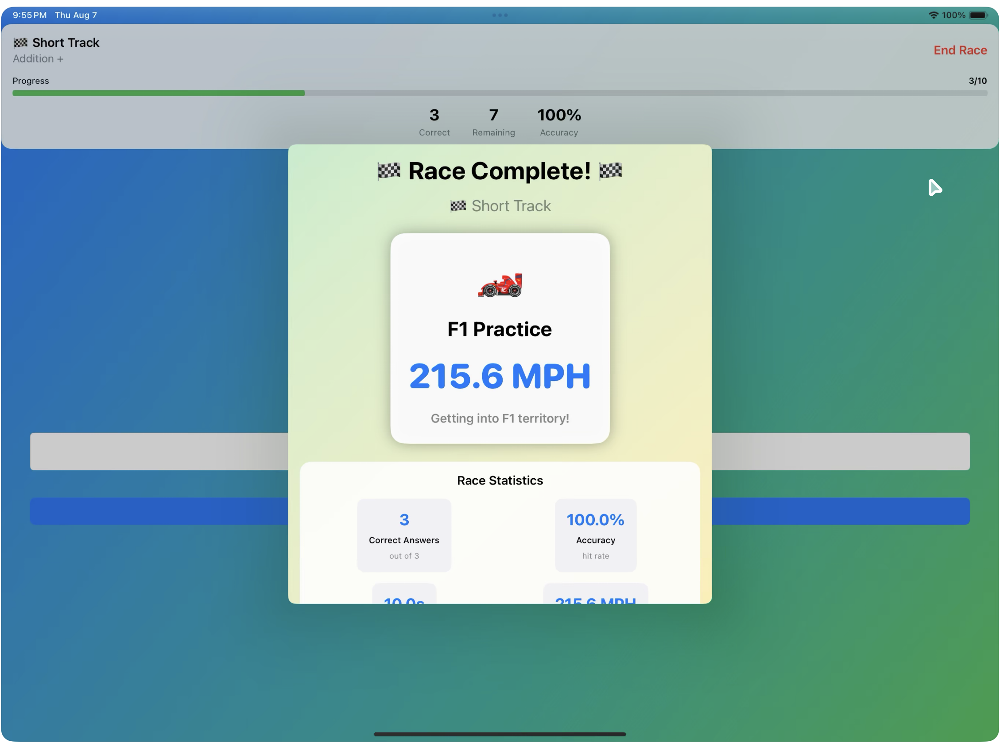

# Raceway Math

A fast-paced, kid-friendly math practice game for **iPhone and iPad**.

[Download on the App Store](https://apps.apple.com/us/app/raceway-math/id6749724993)

## Turn math facts into a race

Raceway Math helps kids practice core arithmetic through quick, energetic races instead of repetitive worksheets.

Players can choose an operation, pick a track length, and solve problems as fast and accurately as they can. It is designed to make practice feel motivating, simple, and fun.

## What kids can practice

- Addition
- Subtraction
- Multiplication
- Division

## Why families like it

- Short practice sessions that fit easily into a busy day
- Bright, simple presentation that is easy for kids to follow
- Tap-friendly controls built for iPhone and iPad
- Encourages both **accuracy** and **speed**
- Useful for home practice, travel, or classroom stations

## Flexible challenge levels

Raceway Math is built to work for different ages and comfort levels.

Players can:

- focus on a specific math operation
- choose a shorter or longer race
- adjust difficulty to match their current skill level
- build confidence first, then increase challenge over time

## No ads. No tracking. No nonsense.

Raceway Math is designed with children and families in mind.

- No ads
- No in-app purchases
- No analytics or personal data collection

Read the full [Privacy Policy](privacy-policy.md).

## Good for parents and teachers

Raceway Math works well for:

- daily math fact warm-ups
- friendly score challenges
- extra repetition for developing fluency
- focused single-operation practice

## Support

If you have questions, feedback, or ideas for improvement:

- App Store: [View Raceway Math](https://apps.apple.com/us/app/raceway-math/id6749724993)
- Privacy Policy: [Read the privacy policy](privacy-policy.md)
